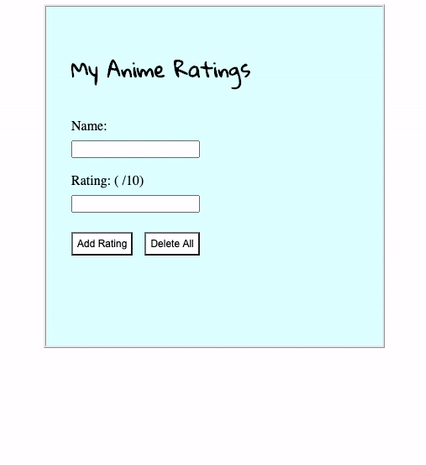

Here's another 'todolist' application where I learn about the Java framework Spring Boot. All things are on local.

\

## Backend: Spring, Mongodb

### Spring
Using Eclipse
> Run MyAnimeRatingsApplication.java

### Mongodb
https://docs.mongodb.com/manual/tutorial/install-mongodb-on-os-x/
> brew services start mongodb-community@4.2

## Frontend: Pure JS
